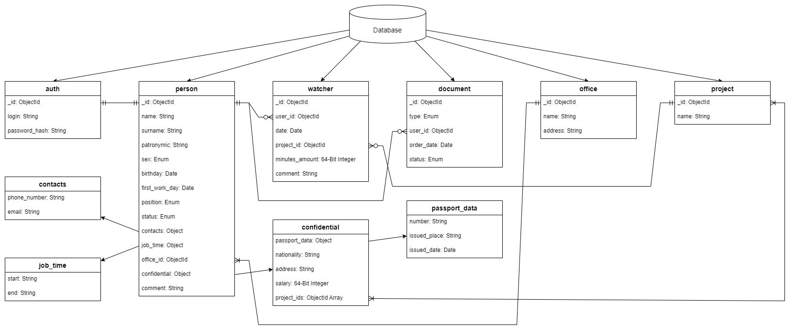
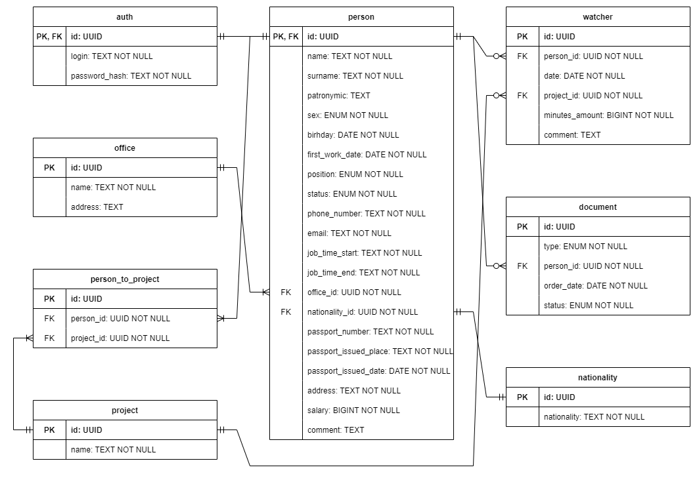

# Модель данных

## Нереляционная база данных

### Графическое представление

Разработана схема нереляционной базы данных:



### Описание коллекций

Описание коллекций приведены ниже (поскольку строки в MongoDB представлены в кодировке UTF-8, то латинские буквы и символы кодируются 1 байтом, а кириллические буквы &ndash; 2 байтами):

```
Database

auth:                               // <- коллекция, содержащая информацию для аутентификации (итого 74 байта)
{
    _id: ObjectId,                  // <- идентификатор пользователя (12 байт)
    login: String,                  // <- логин пользователя (до 15 символов или 15 байт)
    password_hash: String           // <- хэш-код пароля (32 символов или 32 байт)
}

person:                             // <- коллекция, содержащая информацию о работнике (итого 2352 байт)
{
    _id: ObjectId,                  // <- идентификатор пользователя (12 байт)
    name: String,                   // <- имя пользователя (до 40 символов или 80 байт)
    surname: String,                // <- фамилия пользователя (до 40 символов или 80 байт)
    patronymic: String,             // <- отчество пользователя (до 40 символов или 80 байт)
    sex: Enum,                      // <- пол пользователя: 'FEMALE', 'MALE' (6 байт)
    birhday: Date,                  // <- дата рождения (8 байт)
    first_work_date: Date,          // <- дата первого рабочего дня (8 байт) 
    position: Enum,                 // <- должность: 'JUNIOR_BACKEND_DEVELOPER', 'MIDDLE_BACKEND_DEVELOPER', 'SENIOR_BACKEND_DEVELOPER' 'JUNIOR_FRONTEND_DEVELOPER', 'MIDDLE_FRONTEND_DEVELOPER', 'SENIOR_FRONTEND_DEVELOPER', 'JUNIOR_QA_DEVELOPER', 'MIDDLE_QA_DEVELOPER', 'SENIOR_QA_DEVELOPER', 'JUNIOR_DEVOPS_DEVELOPER', 'MIDDLE_DEVOPS_DEVELOPER', 'SENIOR_DEVOPS_DEVELOPER', 'HR', 'PM', 'ADMINISTRATION', 'OFFICE_MANAGER' (25 байт)
    status: Enum,                   // <- статус: 'WORKING', 'ON_HOLIDAY', 'SEEK_LEAVE', 'NOT_WORKING' (11 байт) 
    contacts: {
        phone_number: String,       // <- номер телефона (до 20 символов или 20 байт)
        email: String               // <- электронная почта (до 100 символов или 100 байт)
    },
    job_time: {
        start: String,              // <- начало рабочего дня (5 символов или 5 байт)
        end: String                 // <- конец рабочего дня (5 символов или 5 байт)
    },
    office_id: ObjectId,            // <- идентификатор офиса (12 байт)
    confidential: {
        passport_data: {
            number: String,         // <- серия и номер паспорта (до 20 символов или 40 байт)
            issued_place: String,   // <- место выдачи (до 100 символов или 200 байт)
            issued_date: Date       // <- дата выдачи (8 байт) 
        },
        nationality: String,        // <- гражданство (до 50 символов или 100 байт)
        address: String,            // <- адрес пользователя (до 200 символов или 400 байт)
        salary: 64-Bit Integer,     // <- заработная плата (8 байт)
        project_ids: ObjectId Array // <- идентификаторы проектов (12n байт, где n ≤ 10)
    },
    comment: String                 // <- комментарий (до 512 символов или 1 килобайта)
}

watcher:                            // <- коллекция, содержащая информацию об активности (итого 1264 байт)
{
    _id: ObjectId,                  // <- идентификатор записи (12 байт)
    user_id: ObjectId,              // <- идентификатор пользователя (12 байт)
    date: Date,                     // <- дата активности (8 байт)
    project_id: ObjectId,           // <- название активности (12 байт)
    minutes_amount: 64-Bit Integer, // <- затраченное время (8 байт)
    comment: String                 // <- описание (до 512 символов или 1 килобайта)
}

document:                           // <- коллекция, содержащая информацию о заказе документа (итого 59 байт)
{
    _id: ObjectId,                  // <- идентификатор заявки (12 байт)
    type: Enum,                     // <- название документа: 'INCOME_STATEMENT', 'WORK_STATEMENT' (16 байт)
    user_id: ObjectId,              // <- идентификатор пользователя (12 байт)
    order_date: Date,               // <- дата заказа (8 байт)
    status: Enum                    // <- статус: 'ORDERED', 'IN_PROGRESS', 'DONE', 'CANCELED' (11 байт)
}

office:                             // <- коллекция, содержащая информацию об офисе (итого 512 байт)
{
    _id: ObjectId,                  // <- идентификатор офиса (12 байт)
    name: String,                   // <- название офиса (до 50 символов или 100 байт)
    address: String                 // <- адрес офиса (до 200 символов или 400 байт)
}

project:                            // <- коллекция, содержащая информацию о проекте (итого 112 байт)
{
    _id: ObjectId,                  // <- идентификатор проекта (12 байт)
    name: String                    // <- название проекта (до 50 символов или 100 байт)
}
```

### Пример данных

Ниже представлен пример документа коллекции `auth`:

```
{
    _id: ObjectId("6359c5e317df7f8644c2cea2"),
    login: "your_aksioma",
    password_hash: "8BeNwoHhivE2zbcrhHnX9vqcAZWP1MnV"
}
```

Ниже представлен пример документа коллекции `person`:

```
{
    _id: ObjectId("6359c5e317df7f8644c2cea2"),
    name: "Екатерина",
    surname: "Аксёнова",
    patronymic: "Александровна",
    sex: "FEMALE",
    birthday: Date("2001-11-14"),
    first_work_date: Date("2022-04-14"),
    position: "JUNIOR_BACKEND_DEVELOPER",
    status: "WORKING",
    contacts: {
        phone_number: "79112886438",
        email: "kate.kate6575@gmail.com"
    },
    job_time: {
        start: "11:00",
        end: "20:00"
    },
    officeId: ObjectId("6359c11c2416d454722f826f"),
    confidential: {
        passport_data: {
            number: "BM5653789",
            issued_place: "Октябрьский РОВД",
            issued_date: Date("2015-10-14")
        },
        nationality: "BELARUS",
        address: "Улица Торжковская, дом 15",
        salary: Long("1000000"),
        project_ids: [ObjectId("6359c20fea6757775ceca286")]
    },
    comment: "Устала"
}
```

Ниже представлен пример документа коллекции `watcher`:

```
{
    _id: ObjectId("6359d0baf1339ed8b904fb00"),
    user_id: ObjectId("6359c5e317df7f8644c2cea2"),
    date: Date("2022-10-22"),
    project_id: ObjectId("6359c20fea6757775ceca286"),
    minutes_amount: Long("360"),
    comment: "Сделала авторизацию"
}
```

Ниже представлен пример документа коллекции `document`:

```
{
    _id: ObjectId("6359d3a576a26bfdc3a506e8"),
    user_id: ObjectId("6359c5e317df7f8644c2cea2"),
    type: "INCOME_STATEMENT",
    order_date: Date("2022-10-20"),
    status: "IN_PROGRESS"
}
```

Ниже представлен пример документа коллекции `office`:

```
{
    _id: ObjectId("6359c11c2416d454722f826f"),
    name: "Офис Витебск",
    address: "Улица Чапаева, дом 34"
}
```

Ниже представлен пример документа коллекции `project`:

```
{
    _id: ObjectId("6359c20fea6757775ceca286"),
    name: "Buhinder"
}
```

### Оценка удельного объёма информации

Пусть количество записей в коллекции `A` равняется $x_{\mathrm{A}}$. Весь объём занимаемой памяти равен $V_{actual} = 74\,x_{\mathrm{auth}} + 2352\,x_{\mathrm{person}} + 1264\,x_{\mathrm{watcher}} + 59\,x_{\mathrm{document}} + 512\,x_{\mathrm{office}} + 112\,x_{\mathrm{project}}$.

Количество записей в коллекциях `auth` и `person` одинаково: $x_{\mathrm{person}} = x_{\mathrm{auth}}$. Коллекции `office` и `project` можно считать словарями, а следовательно, их размеры являются константами. Будем считать, что в среднем на каждого пользователя в день приходится по 2 записи в *Watcher*, тогда объём занимаемой памяти коллекции `watcher` равен $x_{\mathrm{watcher}} = 2\,T\,x_{\mathrm{person}}$, где $T$ &ndash; количество дней. Рассмотрим промежуток времени, равный $T = 65$ дней (примерно, 3 месяца без учёта выходных), тогда $x_{\mathrm{watcher}} = 130\,x_{\mathrm{person}}$. Будем также считать, что в среднем каждый пользователь заказывает 2 справки в течение 3 месяцев, тогда объём занимаемой памяти коллекции `document` равен $x_{\mathrm{document}} = 2\,x_{\mathrm{person}}$. Учитывая всё выше перечисленное, получаем следующее значение объёма памяти: $V_{actual} = 166\,864\,x_{\mathrm{person}}$.

### Избыточность модели

Избыточными полями являются те поля коллекций, которые могут повторяться в разных документах. В нашей базе данных к таким полям в худшем случае относятся: `person._id`, `person.sex`, `person.position`, `person.status`, `person.job_time.start`, `person.job_time.end`, `person.office_id`, `person.nationality`, `watcher.user_id`, `watcher.date`, `watcher.project_id`, `document.type`, `document.user_id`, `document.status`. Итого, суммарный объём избыточных данных равен $4\,414\,x_{\mathrm{person}}$, следовательно, "чистый" объём данных равен $V_{clear} = 162\,450\,x_{\mathrm{person}}$.

Таким образом, избыточность модели равна

$$redundancy = \dfrac{V_{actual}}{V_{clear}} \approx 1,027.$$

### Направление роста модели

Анализируя модель данных и полученные результаты, приходим к выводу, что модель растёт с линейной скоростью.

### Запросы к модели

Реализованы запросы к нереляционной модели, с помощью которых реализуются сценарии использования:

- Проверка наличия пользователя в системе:

```
let kateLogin = "your_aksioma";
let katePasswordHash = "8BeNwoHhivE2zbcrhHnX9vqcAZWP1MnV";

db.getCollection("auth")
    .findOne({login: kateLogin, password_hash: katePasswordHash}, {_id: 1});
```

- Показ всех дней в неделе c 03.10.2022 по 07.10.2022 в модуле *Watcher*:

```
let userId = new ObjectId("6359c5e317df7f8644c2cea2");
let firstWeekDate = new Date("2022-10-03");
let lastWeekDate = new Date("2022-10-07");

db.watcher.aggregate(
    {$match: {date: {$gte: firstWeekDate, $lte: lastWeekDate}, user_id: userId}},
    {$group: {_id: "$date", minutes_amount: {$sum: "$minutes_amount"}}}
);
```

- Добавление задачи:

```
let userId = new ObjectId("6359c5e317df7f8644c2cea2");
let specificDateForNewRow = new Date("2022-10-25");
let newProjectId = ObjectId("6359c217e6faf17102236f02");
let newComment = "random new comment";
let newMinutes = Long("1020");

db.watcher.insertOne({
    user_id: userId,
    date: specificDateForNewRow,
    project_id: newProjectId,
    comment: newComment,
    minutes_amount: newMinutes
});
```

- Просмотр задач за 25.10.2022:

```
let userId = new ObjectId("6359c5e317df7f8644c2cea2");
let specificDay = new Date("2022-10-25");

db.watcher.find({user_id: userId, date: specificDay});
```

- Изменение задачи:

```
let watcherId = ObjectId("6359d0baf1339ed8b904fb00");
let newProjectId = ObjectId("6359c217e6faf17102236f02");
let newComment = "random new comment";
let newMinutes = Long("1020");

db.watcher.updateOne(
    {_id: watcherId},
    {$set: {project_id: newProjectId, comment: newComment, minutes_amount: newMinutes}}
);
```

- Удаление задачи:

```
let watcherId = ObjectId("6359d0baf1339ed8b904fb00");

db.watcher.deleteOne({_id: watcherId});
```

- Просмотр дней отпуска:

```
let userId = new ObjectId("6359c5e317df7f8644c2cea2");
let firstMonthDate = new Date("2022-10-01");
let lastMonthDate = new Date("2022-10-31");


db.watcher.aggregate([
    {$match: {date: {$gte: firstMonthDate, $lte: lastMonthDate}, user_id: userId}},
    {$lookup: {from: "project", localField: "project_id", foreignField: "_id", as: "project_info"}},
    {$match: {"project_info.name": "Отпуск"}},
    {$group: {_id: "$date"}},
]);
```

- Просмотр больничных дней:

```
let userId = new ObjectId("6359c5e317df7f8644c2cea2");
let firstMonthDate = new Date("2022-10-01");
let lastMonthDate = new Date("2022-10-31");


db.watcher.aggregate([
    {$match: {date: {$gte: firstMonthDate, $lte: lastMonthDate}, user_id: userId}},
    {$lookup: {from: "project", localField: "project_id", foreignField: "_id", as: "project_info"}},
    {$match: {"project_info.name": "Больничный"}},
    {$group: {_id: "$date"}},
]);
```

- Показ всей информации о пользователе:

```
let userId = new ObjectId("6359c5e317df7f8644c2cea2");

db.person.findOne({_id: userId});
```

- Изменение своих контактов:

```
let userId = new ObjectId("6359c5e317df7f8644c2cea2");
let newPhone = "791112929292";
let newEmail = "muzan@demon.com";

db.person.updateOne(
    {_id: userId},
    {$set: {contacts: {phone_number: newPhone, email: newEmail}}}
);
```

- Поиск сотрудника, в имени которого содержится подстрока "а":

```
let matchExpression = "а";

db.person.find(
    {name: {$regex: matchExpression, $options: "i"}},
    {_id: 1, name: 1, surname: 1, position: 1}
);
```

- Расширенный поиск сотрудника женского пола, у которого присутствует подстрока "а" в имени, фамилии, отчестве, а также в должности и электронной почте, у которого возраст от 18 до 30 лет, в номере телефона которого присутствует набор символов "7":

```
let nameMatchExpression = "а";
let surnameMatchExpression = "а";
let patronymicMatchExpression = "а";
let sexMatch = "FEMALE"
let ageMinMatchExpression = 18;
let ageMaxMatchExpression = 30;
let positionMatchExpression = "a";
let emailMatchExpression = "a";
let phoneMatchExpression = "7";

db.person.aggregate([
    {$addFields: {age: {$dateDiff: {startDate: "$birthday", endDate: new Date(), unit: "year"}}}},
    {
        $match: {
            name: {$regex: nameMatchExpression, $options: "i"},
            surname: {$regex: surnameMatchExpression, $options: "i"},
            patronymic: {$regex: patronymicMatchExpression, $options: "i"},
            sex: {$regex: sexMatch, $options: "i"},
            age: {$gte: ageMinMatchExpression, $lte: ageMaxMatchExpression},
            position: {$regex: positionMatchExpression, $options: "i"},
            "contacts.email": {$regex: emailMatchExpression, $options: "i"},
            "contacts.phone_number": {$regex: phoneMatchExpression, $options: "i"},
        }
    },
    {$unset: "age"},
    {$project: {_id: 1, name: 1, surname: 1, position: 1}}
]);
```

- Заказ справки:

```
let userId = new ObjectId("6359c5e317df7f8644c2cea2");
let nowDate = new Date();
let selectedStatus = "IN_PROGRESS";
let selectedType = "INCOME_STATEMENT";

db.document.insertOne({
    order_date: nowDate, 
    status: selectedStatus, 
    type: selectedType, 
    user_id: userId}
);
```

- Просмотр заказанных справок:

```
let userId = new ObjectId("6359c5e317df7f8644c2cea2");

db.document.find({user_id: userId});
```

- Добавление сотрудника:

```
let muzanAuth = {
    _id: ObjectId("635b14aecc60fb4f04fc25d9"),
    login: "muzan_kibutsuji",
    password_hash: "f415df421177820c3a69db701f424efb"
};

db.getCollection("auth").insertOne(muzanAuth);


let muzanPerson = {
    name: "Muzan",
    surname: "Kibutsuji",
    sex: "MALE",
    birthday: new Date("1095-01-01"),
    first_work_date: new Date("1096-01-01"),
    position: "ADMINISTRATION",
    status: "ON_HOLIDAY",
    contacts: {
        phone_number: "1038492382334",
        email: "muzan@demon.com",
    },
    job_time: {
        start: "09:00",
        end: "18:00",
    },
    officeId: ObjectId("6359c18e62901a6a7db55ef7"),
    confidential: {
        passport_data: {
            number: "BM3478689",
            issued_place: "Октябрьский РОВД",
            issued_date: new Date("2015-10-14")
        },
        nationality: "RUSSIA",
        address: "Улица Торжковская, дом 15",
        salary: Long("1000000"),
        project_ids: [ObjectId("6359c217e6faf17102236f02")],
    },
    comment: "Молодой специалист"
};

db.person.insertOne(muzanPerson);
```

- Изменение информации о сотруднике:

```
let muzanId = ObjectId("635b14aecc60fb4f04fc25d9");
let muzanUpdatedPerson = muzanPerson = {
    status: "WORKING",
    contacts: {
        phone_number: "100001001111",
    },
    job_time: {
        start: "10:00",
        end: "19:00",
    },
    confidential: {
        salary: Long("312000000"),
    },
    comment: "Обновленная информация"
};

db.person.updateOne(
    {_id: muzanId},
    {$set: muzanUpdatedPerson}
);
```

- Удаление сотрудника:

```
let muzanId = ObjectId("635b14aecc60fb4f04fc25d9");

db.person.deleteOne({_id: muzanId})
```

- Просмотр всех заказанных справок:

```
let userId = new ObjectId("6359c5e317df7f8644c2cea2");

db.document.find({
    user_id: userId,
    status: {$in: ["DONE", "ORDERED"]}
});
```

- Изменение статуса заказа на "Отменено":

```
let documentId = ObjectId("6359beb21b389817992710c0");
let newDocumentStatus = "DONE";

db.document.updateOne(
    {_id: documentId},
    {$set: {status: newDocumentStatus}}
);
```

- Сценарий использования "Массовый импорт / экспорт данных"

```
db.getCollection("auth").find();

db.person.aggregate([
    {$lookup: {from: "office", localField: "office_id", foreignField: "_id", as: "office_info"}},
    {$lookup: {from: "project", localField: "confidential.project_ids", foreignField: "_id", as: "confidential.projects_info"}},
    {$unset: ["office_id", "confidential.project_ids"]}
]);

db.document.find();

db.watcher.aggregate(
    {$lookup: {from: "project", localField: "project_id", foreignField: "_id", as: "project_info"}},
    {$unset: ["project_id"]}
);
```

## Реляционная база данных

### Графическое представление

Разработана аналогичная схема реляционной базы данных:



### Описание коллекций

Описание коллекций приведены ниже (будем считать, поскольку строки в SQL представлены в кодировке Unicode, то все символы кодируются 2 байтами):

```
Database

auth:                            // <- таблица, содержащая информацию для аутентификации (итого 110 байта)
{
    id: UUID,                    // <- идентификатор пользователя (16 байт)
    login: TEXT,                 // <- логин пользователя (до 15 символов или 30 байт)
    password_hash: TEXT          // <- хэш-код пароля (32 символов или 64 байта)
}

person:                          // <- таблица, содержащая информацию о работнике (итого 2328 байт)
{
    id: UUID,                    // <- идентификатор пользователя (16 байт)
    name: TEXT,                  // <- имя пользователя (до 40 символов или 80 байт)
    surname: TEXT,               // <- фамилия пользователя (до 40 символов или 80 байт)
    patronymic: TEXT,            // <- отчество пользователя (до 40 символов или 80 байт)
    sex: ENUM,                   // <- пол пользователя: 'FEMALE', 'MALE' (12 байт)
    birhday: DATE,               // <- дата рождения (8 байт)
    first_work_date: DATE,       // <- дата первого рабочего дня (8 байт) 
    position: ENUM,              // <- должность: 'JUNIOR_BACKEND_DEVELOPER', 'MIDDLE_BACKEND_DEVELOPER', 'SENIOR_BACKEND_DEVELOPER' 'JUNIOR_FRONTEND_DEVELOPER', 'MIDDLE_FRONTEND_DEVELOPER', 'SENIOR_FRONTEND_DEVELOPER', 'JUNIOR_QA_DEVELOPER', 'MIDDLE_QA_DEVELOPER', 'SENIOR_QA_DEVELOPER', 'JUNIOR_DEVOPS_DEVELOPER', 'MIDDLE_DEVOPS_DEVELOPER', 'SENIOR_DEVOPS_DEVELOPER', 'HR', 'PM', 'ADMINISTRATION', 'OFFICE_MANAGER' (50 байт)
    status: ENUM,                // <- статус: 'WORKING', 'ON_HOLIDAY', 'SEEK_LEAVE', 'NOT_WORKING' (22 байта) 
    phone_number: TEXT,          // <- номер телефона (до 20 символов или 40 байт)
    email: TEXT,                 // <- электронная почта (до 100 символов или 200 байт)
    job_time_start: TEXT,        // <- начало рабочего дня (5 символов или 10 байт)
    job_time_end: TEXT,          // <- конец рабочего дня (5 символов или 10 байт)
    office_id: UUID,             // <- идентификатор офиса (16 байт)
    nationality_id: UUID,        // <- идентификатор гражданства (16 байт)
    passport_number: TEXT,       // <- серия и номер паспорта (до 20 символов или 40 байт)
    passport_issued_place: TEXT, // <- место выдачи (до 100 символов или 200 байт)
    passport_date: DATE,         // <- дата выдачи (8 байт)
    address: TEXT,               // <- адрес пользователя (до 200 символов или 400 байт)
    salary: BIGINT,              // <- заработная плата (8 байт)
    comment: TEXT                // <- комментарий (до 512 символов или 1 килобайта)
}

office:                          // <- таблица, содержащая информацию об офисе (итого 516 байт)
{
    id: UUID,                    // <- идентификатор офиса (16 байт)
    name: TEXT,                  // <- название офиса (до 50 символов или 100 байт)
    address: TEXT                // <- адрес офиса (до 200 символов или 400 байт)
}

person_to_project:               // <- таблица, сопостовляющая пользователя и его проекты (итого 48 байт)
{
    id: UUID,                    // <- идентификатор (16 байт)
    person_id: UUID,             // <- идентификатор пользователя (16 байт)
    project_id: UUID             // <- идентификатор проекта (16 байт)
}

project:                         // <- таблица, содержащая информацию о проекте (итого 116 байт)
{
    id: UUID,                    // <- идентификатор проекта (16 байт)
    name: TEXT                   // <- название проекта (до 50 символов или 100 байт)
}

nationality:                     // <- таблица, содержащая информацию о гражданствах (итого 116 байт)
{
    id: UUID,                    // <- идентификатор гражданства (16 байт)
    nationality: TEXT            // <- название гражданства (до 50 символов или 100 байт)
}

watcher:                         // <- таблица, содержащая информацию об активности (итого 1088 байт)
{
    id: UUID,                    // <- идентификатор записи (16 байт)
    person_id: UUID,             // <- идентификатор пользователя (16 байт)
    date: DATE,                  // <- дата активности (8 байт)
    project_id: UUID,            // <- название активности (16 байт)
    minutes_amount: BIGINT,      // <- затраченное время (8 байт)
    comment: TEXT                // <- описание (до 512 символов или 1 килобайта)
}

document:                        // <- таблица, содержащая информацию о заказе документа (итого 94 байт)
{
    id: UUID,                    // <- идентификатор заявки (16 байт)
    type: ENUM,                  // <- название документа: 'INCOME_STATEMENT', 'WORK_STATEMENT' (32 байта)
    person_id: UUID,             // <- идентификатор пользователя (16 байт)
    order_date: DATE,            // <- дата заказа (8 байт)
    status: ENUM                 // <- статус: 'ORDERED', 'IN_PROGRESS', 'DONE', 'CANCELED' (22 байта)
}
```

### Пример данных

Ниже представлен пример записи таблицы `auth`:

```
{
    id: "78a1f37d-9043-4783-a5f5-3a353d9bff49",
    login: "your_aksioma",
    password_hash: "8BeNwoHhivE2zbcrhHnX9vqcAZWP1MnV"
}
```

Ниже представлен пример записи таблицы `person`:

```
{
    id: "78a1f37d-9043-4783-a5f5-3a353d9bff49",
    name: "Екатерина",
    surname: "Аксёнова",
    patronymic: "Александровна",
    sex: "FEMALE",
    birhday: "2001-11-14",
    first_work_date: "2022-04-14",
    position: "JUNIOR_BACKEND_DEVELOPER",
    status: "WORKING", 
    phone_number: "79112886438",
    email: "kate.kate6575@gmail.com",
    job_time_start: "11:00",
    job_time_end: "20:00",
    office_id: "c74c02eb-2411-4dfd-bf29-d2d9a65219ca",
    nationality_id: "ccfe6bb0-b1e3-4210-9ef9-fc57746599df",
    passport_number: "BM5653789",
    passport_issued_place: "Октябрьский РОВД",
    passport_date: "2015-10-14",
    address: "Улица Торжковская, дом 15",
    salary: 1000000,
    comment: "Устала"
}
```

Ниже представлен пример записи таблицы `office`:

```
{
    id: "c74c02eb-2411-4dfd-bf29-d2d9a65219ca",
    name: "Офис Витебск",
    address: "Улица Чапаева, дом 34"
}
```

Ниже представлен пример записи таблицы `person_to_project`:

```
{
    id: "094032ae-587f-48a7-962d-6f817d6b8f49",
    person_id: "78a1f37d-9043-4783-a5f5-3a353d9bff49",
    project_id: "a0092694-19de-4dc8-8d54-ac75594920b2"
}
```

Ниже представлен пример записи таблицы `project`:

```
{
    id: "a0092694-19de-4dc8-8d54-ac75594920b2",
    name: "Buhinder"
}
```

Ниже представлен пример записи таблицы `nationality`:

```
{
    id: "ccfe6bb0-b1e3-4210-9ef9-fc57746599df",
    nationality: "BELARUS"
}
```

Ниже представлен пример записи таблицы `watcher`:

```
{
    id: "43bb4c5c-fe1d-483d-90f4-23b4adc3505f",
    person_id: "78a1f37d-9043-4783-a5f5-3a353d9bff49",
    date: "2022-10-22",
    project_id: "a0092694-19de-4dc8-8d54-ac75594920b2",
    minutes_amount: 360,
    comment: "Сделала авторизацию"
}
```

Ниже представлен пример записи таблицы `document`:

```
{
    id: "cdbeeadc-ad3e-4b90-92e6-2fd3f44d8c13",
    person_id: "78a1f37d-9043-4783-a5f5-3a353d9bff49",
    type: "INCOME_STATEMENT",
    order_date: "2022-10-20",
    status: "IN_PROGRESS"
}
```

### Оценка удельного объёма информации

Пусть количество записей в коллекции `A` равняется $x_{\mathrm{A}}$. Весь объём занимаемой памяти равен $V_{actual} = 110\,x_{\mathrm{auth}} + 2328\,x_{\mathrm{person}} + 516\,x_{\mathrm{office}} + 48\,x_{\mathrm{person\_to\_project}} + 116\,x_{\mathrm{project}} + 116\,x_{\mathrm{nationality}} + 1088\,x_{\mathrm{watcher}} + 94\,x_{\mathrm{document}}$.

Аналогично расчётам оценки удельного объёма информации в нереляционной базе данных заключаем, что $x_{\mathrm{auth}} = x_{\mathrm{person}}$, $x_{\mathrm{office}} = \mathrm{const}$, $x_{\mathrm{project}} = \mathrm{const}$, $x_{\mathrm{watcher}} = 130\,x_{\mathrm{person}}$, $x_{\mathrm{document}} = 2\,x_{\mathrm{person}}$. Аналогично коллекциям `office` и `project` коллекцию `nationality` можно считать словарём: $x_{\mathrm{document}} = \mathrm{const}$. Поскольку количество проектов у человека не превышает 10, то $x_{\mathrm{person\_to\_project}} = 10\,x_{\mathrm{person}}$. Учитывая всё выше перечисленное, получаем следующее значение объёма памяти: $V_{actual} = 144\,546\,x_{\mathrm{person}}$.

### Избыточность модели

Избыточными полями являются те поля коллекций, которые могут повторяться в разных документах. В нашей базе данных к таким полям в худшем случае относятся: `person._id`, `person.sex`, `person.position`, `person.status`, `person.job_time.start`, `person.job_time.end`, `person.office_id`, `person.nationality`, `watcher.user_id`, `watcher.date`, `watcher.project_id`, `document.type`, `document.user_id`, `document.status`. Итого, суммарный объём избыточных данных равен $5\,524\,x_{\mathrm{person}}$, следовательно, "чистый" объём данных равен $V_{clear} = 139\,022\,x_{\mathrm{person}}$.

Таким образом, избыточность модели равна

$$redundancy = \dfrac{V_{actual}}{V_{clear}} \approx 1,040.$$

### Направление роста модели

Анализируя модель данных и полученные результаты, приходим к выводу, что модель растёт с линейной скоростью.

### Запросы к модели

Реализованы запросы к реляционной модели, с помощью которых реализуются сценарии использования:

- Проверка наличия пользователя в системе:

```
WITH my_constants (usr_login, usr_password_hash)
  as (values ('your_aksioma', '8BeNwoHhivE2zbcrhHnX9vqcAZWP1MnV'))

SELECT id
FROM auth
WHERE login = (SELECT usr_login FROM my_constants)
  AND password_hash = (SELECT usr_password_hash FROM my_constants);
```

- Показ всех дней в неделе c 03.10.2022 по 07.10.2022 в модуле *Watcher*:

```
WITH my_constants (usr_id, usr_date_start, usr_date_end)
  as (values ('78a1f37d-9043-4783-a5f5-3a353d9bff49', '2022-10-24', '2022-10-28'))

SELECT date, SUM(minutes_amount)
FROM watcher
WHERE person_id = (SELECT usr_id::uuid FROM my_constants) 
  AND date BETWEEN (SELECT usr_date_start::date FROM my_constants) AND (SELECT usr_date_end::date FROM my_constants)
GROUP BY date;
```

- Добавление задачи:

```
WITH my_constants (usr_id, usr_date, usr_project_name, usr_time, usr_comment)
  as (values ('78a1f37d-9043-4783-a5f5-3a353d9bff49', '2022-10-25', 'Buhinder', 360, 'Сделала авторизацию X2'))

INSERT 
INTO watcher (person_id, date, project_id, minutes_amount, comment)
SELECT (SELECT usr_id::uuid FROM my_constants),
       (SELECT usr_date::date FROM my_constants),
       project.id,
       (SELECT usr_time FROM my_constants),
       (SELECT usr_comment FROM my_constants)
FROM project
WHERE name = (SELECT usr_project_name FROM my_constants);
```

- Просмотр задач за 25.10.2022:

```
WITH my_constants (usr_id, usr_date) 
  as (values ('78a1f37d-9043-4783-a5f5-3a353d9bff49', '2022-10-25'))

SELECT p.name, watcher.minutes_amount, watcher.comment
FROM watcher
  LEFT JOIN project p on watcher.project_id = p.id
WHERE person_id = (SELECT usr_id::uuid FROM my_constants)
  AND date = (SELECT usr_date::date FROM my_constants);
```

- Изменение задачи:

```
WITH my_constants (usr_watcher_id, usr_time, usr_comment)
  as (values ('6aa884fe-d01b-4e30-b64a-c71d16ddb308', 480, 'Создал бд для справок'))

UPDATE watcher
SET minutes_amount = (SELECT usr_time FROM my_constants),
    comment        = (SELECT usr_comment FROM my_constants)
WHERE id = (SELECT usr_watcher_id::uuid FROM my_constants);
```

- Удаление задачи:

```
WITH my_constants (usr_watcher_id) 
  as (values ('f6221d65-af6e-4c4c-b071-bb85936ae25f'))

DELETE
FROM watcher
WHERE id = (SELECT usr_watcher_id::uuid FROM my_constants);
```

- Просмотр дней отпуска:

```
WITH my_constants (usr_activity) 
  as (values ('Отпуск'))

SELECT watcher.date
FROM watcher
  JOIN project p on p.id = watcher.project_id
WHERE p.name = (SELECT usr_activity FROM my_constants);
```

- Просмотр больничных дней:

```
WITH my_constants (usr_activity) 
  as (values ('Больничный'))

SELECT watcher.date
FROM watcher
  JOIN project p on p.id = watcher.project_id
WHERE p.name = (SELECT usr_activity FROM my_constants);
```

- Показ всей информации о пользователе:

```
WITH my_constants (usr_id)
  as (values ('78a1f37d-9043-4783-a5f5-3a353d9bff49'))

SELECT *
FROM person
WHERE id = (SELECT usr_id::uuid FROM my_constants);
```

- Изменение своих контактов:

```
WITH my_constants (usr_id, usr_number, usr_email)
  as (values ('78a1f37d-9043-4783-a5f5-3a353d9bff49', '79179842361', 'kate6575@gmail.com'))

UPDATE person
SET email        = (SELECT usr_email FROM my_constants),
    phone_number = (SELECT phone_number FROM my_constants)
WHERE id = (SELECT usr_id::uuid FROM my_constants);
```

- Поиск сотрудника, в имени которого содержится подстрока "а":

```
WITH my_constants (name_pattern)
  as (values ('%а%'))

SELECT id, name, surname, position
FROM person
WHERE name ILIKE (SELECT name_pattern FROM my_constants);
```

- Расширенный поиск сотрудника женского пола, у которого присутствует подстрока "а" в имени, фамилии, отчестве, а также в должности и электронной почте, у которого возраст от 18 до 30 лет, в номере телефона которого присутствует набор символов "7":

```
WITH my_constants (name_pattern, surname_pattern, patronymic_pattern, age_min, age_max, sex, position_pattern, email_pattern, number_pattern)
  as (values ('%а%', '%а%', '%а%', 18, 30, 'FEMALE', '%a%', '%a%', '%7%'))

SELECT id, name, surname, position
FROM person
WHERE name ILIKE (SELECT name_pattern FROM my_constants)
  AND surname ILIKE (SELECT surname_pattern FROM my_constants)
  AND patronymic ILIKE (SELECT patronymic_pattern FROM my_constants)
  AND DATE_PART('year', AGE(now(), birthday)) BETWEEN (SELECT age_min FROM my_constants) AND (SELECT age_max FROM my_constants)
  AND sex = (SELECT sex::sex FROM my_constants)
  AND position::text ILIKE (SELECT position_pattern FROM my_constants)
  AND email ILIKE (SELECT email_pattern FROM my_constants)
  AND phone_number ILIKE (SELECT number_pattern FROM my_constants);
```

- Заказ справки:

```
WITH my_constants (usr_id, doc_type)
  as (values ('78a1f37d-9043-4783-a5f5-3a353d9bff49', 'WORK_STATEMENT'))

INSERT
INTO document(type, person_id, order_date, status)
VALUES ((SELECT doc_type::document_type FROM my_constants), (SELECT usr_id::uuid FROM my_constants), CURRENT_DATE, 'ORDERED');
```

- Просмотр заказанных справок:

```
WITH my_constants (usr_id)
  as (values ('78a1f37d-9043-4783-a5f5-3a353d9bff49'))

SELECT *
FROM document
WHERE person_id = (SELECT usr_id::uuid FROM my_constants);
```

- Добавление сотрудника:

```
WITH my_constants_auth (id, login, password_hash)
  as (values ('c48fcdb6-4bed-435b-9d1b-6947ccb77644'::uuid, 'lelen', 'm5C09li7Qk/4ifl7IwPXxY96j/YNQZq4'))

INSERT
INTO auth (id, login, password_hash)
SELECT *
FROM my_constants_auth;


WITH my_constants_person (id, usr_name, usr_surname, usr_patronymic, usr_sex, 
                          usr_birthday, usr_first_work_day, usr_position, usr_status, 
                          usr_phone_number, usr_email, usr_job_time_start, usr_job_time_end, usr_office_id, 
                          usr_nationality_id, usr_passport_number, usr_passport_issued_place, usr_passport_issued_date, 
                          usr_address, usr_salary, usr_comment)
  as (values ('c48fcdb6-4bed-435b-9d1b-6947ccb77644'::uuid, 'Елена', 'Иванова', 'Алексеевна', 'FEMALE'::sex, 
              '2001-10-14'::date, '2022-07-14'::date, 'JUNIOR_BACKEND_DEVELOPER'::usr_position, 'WORKING'::person_status,
              '79117236438', 'lelens@gmail.com', '9:00', '18:00', 'bd711817-57a0-430d-8553-15dd4e3d7de0'::uuid,
              'f7d00710-1f66-46d8-a3de-b0e4536774a1'::uuid, 'BM3478689', 'Октябрьский РОВД', '2015-10-14'::date,
              'Улица Торжковская, дом 15', 1000000, 'Молодой специалист'))

INSERT
INTO person (id, name, surname, patronymic, sex, 
             birthday, first_work_day, position, status,
             phone_number, email, job_time_start, job_time_end, office_id, 
             nationality_id, passport_number, passport_issued_place, passport_issued_date, 
             address, salary, comment)
SELECT *
FROM my_constants_person;
```

- Изменение информации о сотруднике:

```
WITH my_constants (usr_id, usr_name, usr_surname, usr_patronymic, usr_sex, 
                   usr_birthday, usr_first_work_day, usr_position, usr_status, 
                   usr_phone_number, usr_email, usr_job_time_start, usr_job_time_end, usr_office_id, 
                   usr_nationality_id, usr_passport_number, usr_passport_issued_place, usr_passport_issued_date, 
                   usr_address, usr_salary, usr_comment)
  as (values ('c48fcdb6-4bed-435b-9d1b-6947ccb77644'::uuid, 'Лена', 'Иванова', 'Алексеевна', 'FEMALE'::sex,
              '2001-10-14'::date, '2022-07-14'::date, 'JUNIOR_BACKEND_DEVELOPER'::usr_position, 'WORKING'::person_status,
              '79117236438', 'lelens@gmail.com', '9:00', '18:00', 'bd711817-57a0-430d-8553-15dd4e3d7de0'::uuid,
              'f7d00710-1f66-46d8-a3de-b0e4536774a1'::uuid,'BM3478689', 'Октябрьский РОВД', '2015-10-14'::date,
              'Улица Торжковская, дом 15', 1000000, 'Молодой специалист'))

UPDATE person
SET name                  = (SELECT usr_name FROM my_constants),
    surname               = (SELECT usr_surname FROM my_constants),
    patronymic            = (SELECT usr_patronymic FROM my_constants),
    sex                   = (SELECT usr_sex FROM my_constants),
    birthday              = (SELECT usr_birthday FROM my_constants),
    first_work_day        = (SELECT usr_first_work_day FROM my_constants),
    position              = (SELECT usr_position FROM my_constants),
    status                = (SELECT usr_status FROM my_constants),
    phone_number          = (SELECT usr_phone_number FROM my_constants),
    email                 = (SELECT usr_email FROM my_constants),
    job_time_start        = (SELECT usr_job_time_start FROM my_constants),
    job_time_end          = (SELECT usr_job_time_end FROM my_constants),
    office_id             = (SELECT usr_office_id FROM my_constants),
    nationality_id        = (SELECT usr_nationality_id FROM my_constants),
    passport_number       = (SELECT usr_passport_number FROM my_constants),
    passport_issued_place = (SELECT usr_passport_issued_place FROM my_constants),
    passport_issued_date  = (SELECT usr_passport_issued_date FROM my_constants),
    address               = (SELECT usr_address FROM my_constants),
    salary                = (SELECT usr_salary FROM my_constants),
    comment               = (SELECT usr_comment FROM my_constants)
WHERE id = (SELECT usr_id::uuid FROM my_constants);
```

- Удаление сотрудника:

```
WITH my_constants (usr_id)
  as (values ('78a1f37d-9043-4783-a5f5-3a353d9bff49'))

UPDATE person
SET status = 'NOT_WORKING'
WHERE id = (SELECT usr_id::uuid FROM my_constants);
```

- Просмотр всех заказанных справок:

```
SELECT *
FROM person
  LEFT JOIN document d on person.id = d.person_id
  LEFT JOIN nationality n on person.nationality_id = n.id
  LEFT JOIN office o on person.office_id = o.id
WHERE d.status NOT IN ('DONE', 'CANCELED');
```

- Изменение статуса заказа на "Отменено":

```
WITH my_constants (doc_id, new_status)
  as (values ('703d1140-96b8-4543-bf17-3d393c41f332', 'CANCELED'))

UPDATE document
SET status = (SELECT new_status::document_status FROM my_constants)
WHERE id = (SELECT doc_id::uuid FROM my_constants);
```

- Сценарий использования "Массовый импорт / экспорт данных"

```
SELECT *
FROM person
  LEFT JOIN document d on person.id = d.person_id
  LEFT JOIN nationality n on person.nationality_id = n.id
  LEFT JOIN office o on person.office_id = o.id;

SELECT *
FROM person
  LEFT JOIN auth a on person.id = a.id
  LEFT JOIN nationality n on person.nationality_id = n.id
  LEFT JOIN office o on person.office_id = o.id;

SELECT *
FROM person
  LEFT JOIN nationality n on person.nationality_id = n.id
  LEFT JOIN office o on person.office_id = o.id
  LEFT JOIN person_to_project ptp on person.id = ptp.person_id
  LEFT JOIN project p on ptp.project_id = p.id;

SELECT *
FROM person
  LEFT JOIN watcher w on person.id = w.person_id
  LEFT JOIN nationality n on person.nationality_id = n.id
  LEFT JOIN office o on person.office_id = o.id;
```

## Сравнение моделей

Сравнение реляционной и нереляционной моделей представленно в следующей таблице:

|   |SQL|NoSQL|
|---|---|---|
|Удельный объём информации|$144\,546\,x$|$166\,864\,x$|
|Избыточность|$1,040$|$1,027$|
|Среднее количество запросов|$2,15$|$1,20$|
|Количество коллекций|8|6|

Исходя из вышеприведённых результатов можно заключить, что реляционная база данных занимает меньше памяти, чем нереляционная, однако избыточность данных у неё больше. Также преимуществом нереляционной БД является меньшее количество обращений к коллекциям.
